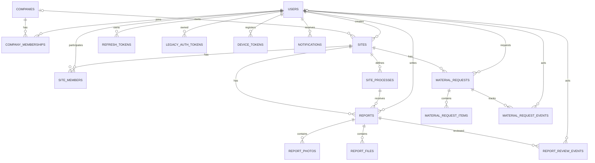

# BuildUp ERD

아래 ERD는 관계 파악을 위한 개요입니다. 정확한 컬럼 타입과 제약은 백엔드 저장소의 Flyway V1~V8을 기준으로 합니다.

- 이 파일의 Mermaid 코드는 검색·수정과 AI 분석에 적합합니다.
- 사람이 한눈에 확인할 때는 [ERD 이미지](ERD이미지.png)를 사용합니다.

## 해석할 때 주의할 점

- `SITES`와 `COMPANIES`의 관계는 선택 사항이므로 현장에 회사가 없을 수 있습니다.
- `REPORT_REVIEW_EVENTS`와 `MATERIAL_REQUEST_EVENTS`는 당시 처리자 표시값도 별도로 보존합니다.
- 컬렉션 테이블은 부모와 순서 또는 식별값을 조합한 무결성 제약을 가집니다.
