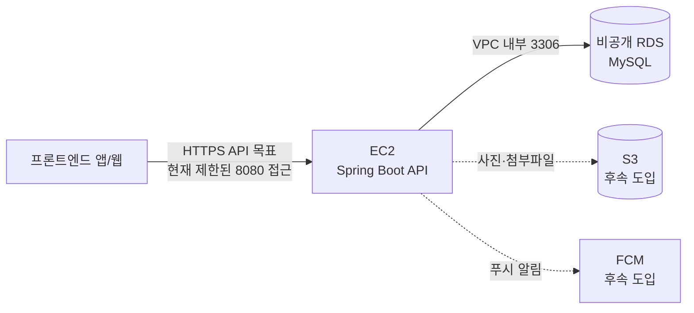

# 시스템 구성도

```mermaid
flowchart LR
    FE[프론트엔드 앱/웹]
    API[EC2<br/>Spring Boot API]
    DB[(비공개 RDS<br/>MySQL)]
    S3[(S3<br/>후속 도입)]
    FCM[FCM<br/>후속 도입]

    FE -->|HTTPS API 목표<br/>현재 제한된 8080 접근| API
    API -->|VPC 내부 3306| DB
    API -.->|사진·첨부파일| S3
    API -.->|푸시 알림| FCM
```

- 실선은 현재 구현된 핵심 연결입니다.
- 점선은 후속 작업에서 연결할 대상입니다.
- RDS는 인터넷에 공개하지 않습니다.
