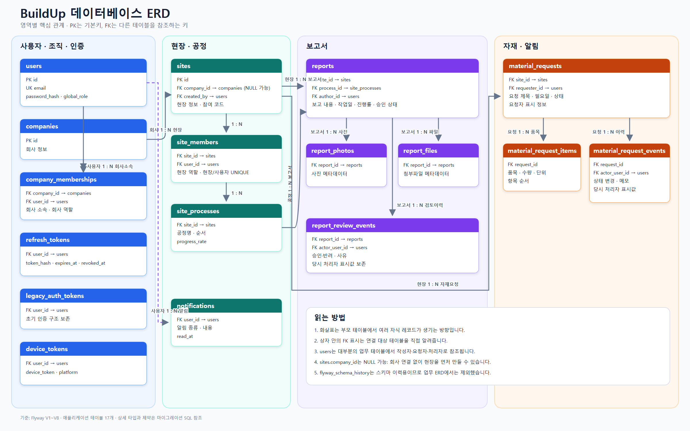

# DB 구조와 ERD

## 관리 원칙

- DB 구조 변경은 Flyway 마이그레이션으로만 수행합니다.
- 이미 적용된 `V1`~`V8` 파일은 수정하지 않습니다.
- 다음 변경은 `V9__설명.sql`처럼 새 파일로 추가합니다.
- 운영 JPA 설정은 `ddl-auto=validate`로 두어 엔티티와 스키마 불일치를 감지합니다.
- DBeaver는 조회와 점검에 사용하고, 다이어그램 편집으로 운영 스키마를 변경하지 않습니다.

## 현재 테이블

애플리케이션 테이블 17개와 Flyway 이력 테이블 1개, 총 18개가 존재합니다.

| 영역 | 테이블 | 역할 |
|---|---|---|
| 조직 | `companies` | 회사 정보 |
| 조직 | `company_memberships` | 사용자와 회사의 소속 및 역할 |
| 사용자 | `users` | 계정, 비밀번호 해시, 전역 권한 |
| 인증 | `refresh_tokens` | Refresh Token 해시와 만료·폐기 상태 |
| 인증 | `legacy_auth_tokens` | 초기 인증 토큰 구조 보존용 레거시 테이블 |
| 현장 | `sites` | 현장 정보, 회사 연결은 선택 사항 |
| 현장 | `site_members` | 현장 구성원과 현장별 역할 |
| 공정 | `site_processes` | 현장 공정과 진행률 |
| 보고서 | `reports` | 공정 보고서와 승인 상태 |
| 보고서 | `report_photos` | 보고서 사진 메타데이터 |
| 보고서 | `report_files` | 보고서 첨부파일 메타데이터 |
| 보고서 | `report_review_events` | 승인·반려 이력과 당시 처리자 정보 |
| 자재 | `material_requests` | 자재 요청 본문과 상태 |
| 자재 | `material_request_items` | 자재 요청 품목 컬렉션 |
| 자재 | `material_request_events` | 상태 변경 이력과 처리자 정보 |
| 알림 | `notifications` | 사용자별 알림과 읽음 상태 |
| 디바이스 | `device_tokens` | 푸시 발송 대상 디바이스 토큰 |
| 스키마 | `flyway_schema_history` | 적용한 마이그레이션 이력 |

## 주요 관계와 제약

- `users.email`은 사용자 식별을 위해 UNIQUE입니다.
- `sites.company_id`는 회사가 정해지지 않은 현장도 허용하기 위해 NULL이 가능합니다.
- `site_members`는 같은 사용자가 같은 현장에 중복 가입하지 못하도록 묶음 UNIQUE를 사용합니다.
- 보고서 사진·파일과 자재 요청 항목은 부모 레코드에 속하는 컬렉션으로 관리합니다.
- 승인·반려 및 자재 처리 이력은 당시 처리자 표시값과 실제 사용자 FK를 함께 보존합니다.
- 조회가 잦은 현장, 상태, 작성자, 생성 시각 조합에는 보조 인덱스가 적용되어 있습니다.

전체 관계는 용도에 따라 두 가지 형태로 제공합니다.

- AI·개발자 확인용: [텍스트 기반 ERD](../diagrams/ERD-텍스트.md)
- 사람 확인용: [ERD 이미지](../diagrams/ERD이미지.png)

## Flyway 이력

| 버전 | 내용 |
|---|---|
| V1 | 초기 13개 테이블 생성 |
| V2 | 초기 인증 토큰을 레거시로 보존하고 Refresh Token 구조 도입 |
| V3 | 회사 소속과 문맥별 역할 구조 추가 |
| V4 | 보고서 승인·반려 워크플로와 이력 추가 |
| V5 | 자재 이벤트와 실제 처리자 사용자 연결 |
| V6 | 조회 인덱스와 컬렉션 무결성 제약 보강 |
| V7 | 알림 테이블 추가 |
| V8 | 현장 생성자를 소유자 구성원으로 일관되게 보정 |

## 배포 DB 상태

1차 배포 검증 데이터는 초기화했습니다. 현재 배포 DB에는 Flyway V1~V8 스키마가 적용되어 있고 업무 데이터는 없는 상태입니다.
